# Top 12 Electricity Rate Comparison Platforms Ranked in 2025 (Latest Compilation)

Shopping for electricity shouldn't feel like navigating a minefield. You're staring at rates that change every fifteen minutes, plans with hidden fees buried in fine print, and providers promising savings they can't deliver. Meanwhile, your bill keeps climbing.

Here's the thing: deregulated energy markets were supposed to give you control. Instead, they handed you a problem—too many options, not enough clarity, and zero guarantee you're getting a fair deal. These electricity comparison platforms cut through that noise. They translate confusing rate structures into actual costs, filter out predatory pricing, and show you what you'll really pay based on how you actually use power.

## **[ComparePower](https://comparepower.com)**

Texas electricity shopping without the guesswork or subscription fees.

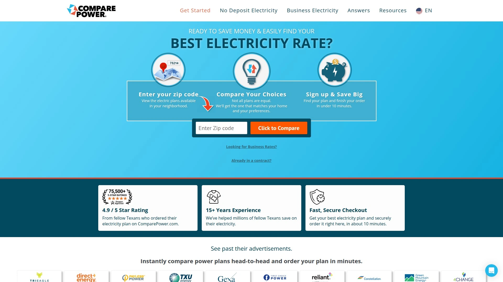

ComparePower serves the Texas deregulated market with a straightforward approach to finding electricity plans. The platform lets you input your actual usage patterns and displays all-inclusive pricing—meaning what you see includes both energy charges and delivery fees. No monthly subscription required.

The site's calculator accounts for your home's unique consumption profile rather than relying on generic usage tiers. You can filter results by contract length, renewable energy content, or plan structure, then compare details side-by-side. Plans are sorted by true cost at your usage level, putting the cheapest options at the top of your results.

ComparePower pulls data from the state-run Power to Choose marketplace but adds critical functionality that marketplace lacks—actual bill projections based on real usage curves throughout the year. The platform eliminates gimmicky plans with intro rates that spike after a few months.

Their filtering system helps you narrow choices based on what matters: fixed versus variable rates, green energy percentages, contract terms, and whether plans include usage credits. You can complete the entire shopping and enrollment process in under ten minutes without talking to anyone.

## **[EnergyBot](https://www.energybot.com)**

Direct utility data integration for personalized rate calculations across eleven states.

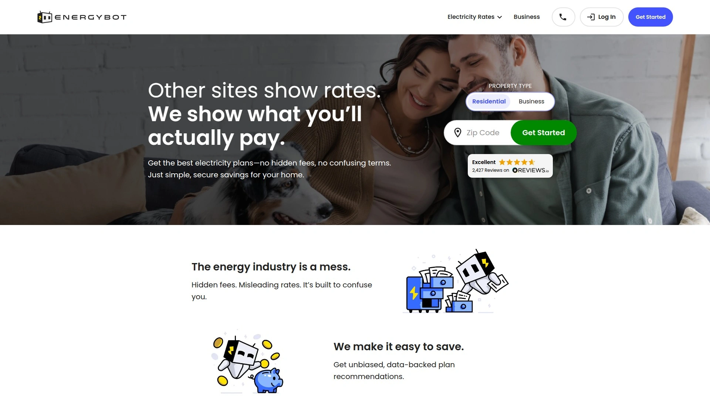

EnergyBot operates in Texas plus ten other deregulated states including Illinois, Ohio, Pennsylvania, New York, and New Jersey. The platform's key differentiator is its ability to connect directly to your utility account and pull your actual usage history. This eliminates estimation errors that lead to bill shock.

After linking your account, EnergyBot's algorithm analyzes your consumption patterns and calculates projected bills for every available plan. The system factors in seasonal variations, time-of-use patterns, and contract structures to deliver accurate cost forecasts.

The platform filters out plans with deceptive pricing structures and highlights straightforward fixed-rate options. Results show estimated monthly costs rather than just per-kilowatt-hour rates, giving you a realistic picture of what switching will mean for your budget.

EnergyBot serves both residential and commercial customers. Business clients benefit from the same data-driven approach scaled to commercial usage levels and demand charges. The service is free to use, with the company receiving small referral fees when customers enroll through their platform.

## **[Texas Electricity Ratings](https://www.texaselectricityratings.com)**

Provider rankings backed by over twelve thousand verified customer reviews.

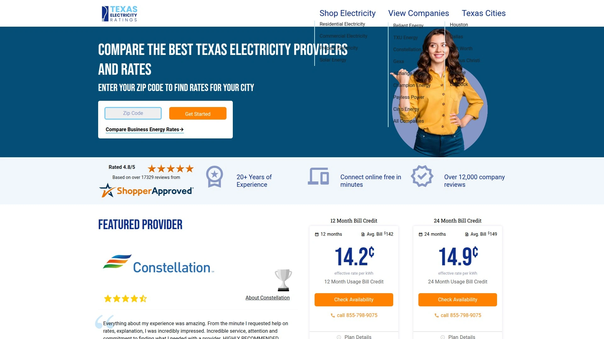

This Texas-focused platform combines rate comparison tools with extensive customer feedback. The site maintains one of the largest databases of verified electricity provider reviews in the state, with detailed ratings covering billing accuracy, customer service responsiveness, and contract transparency.

Texas Electricity Ratings evaluates providers across more than forty data points, then ranks both companies and individual plans. Their bill calculator uses actual usage curves rather than simple multiplication, accounting for how charges vary throughout the year based on tiered pricing and seasonal adjustments.

The platform specifically calls out plans with hidden fees, intro rate gimmicks, or confusing bill credit structures. Each plan listing includes a plain-language summary explaining how charges work and flagging potential gotchas.

Reviews are verified through account information, filtering out fake or promotional content. Users can read detailed experiences from other customers about billing issues, service quality, and whether advertised savings materialized.

## **[Choose Energy](https://www.chooseenergy.com)**

Multi-state marketplace with expert-curated seasonal recommendations.

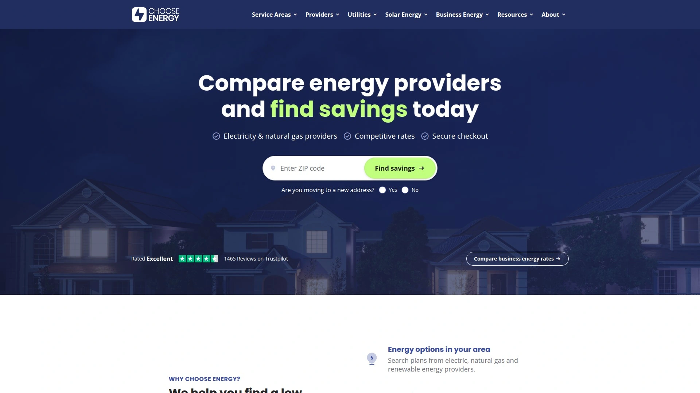

Choose Energy operates across all major deregulated markets in the United States. The marketplace features plans from dozens of providers with real-time rate updates. Their team of energy specialists regularly curates recommended plans based on seasonal trends and market conditions.

The platform includes detailed plan breakdowns showing exactly how rates are calculated, what fees apply, and whether deposits are required. Filtering options help you narrow results by contract length, renewable energy content, plan type, and price range.

Choose Energy's content library provides extensive educational resources about deregulation, how to read an Electricity Facts Label, and strategies for timing your switch to capture lower rates. Their ZIP code tool instantly shows available plans in your service area.

The site offers both residential and commercial comparisons. Business customers get access to specialized tools that factor in demand charges, peak usage patterns, and multi-site account management. Customer support specialists are available by phone to explain plan details and help with enrollment.

## **[ElectricityPlans](https://electricityplans.com/texas)**

Detailed plan analysis for Pennsylvania and Texas markets with emphasis on contract transparency.

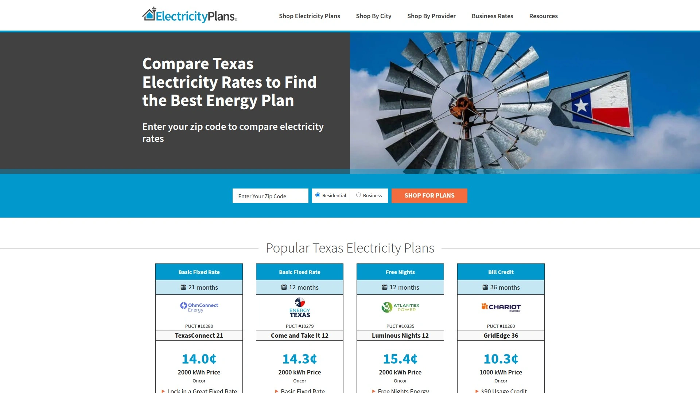

ElectricityPlans focuses on helping customers understand complex rate structures before they commit. The platform serves Pennsylvania and Texas, providing detailed breakdowns of how each plan calculates charges throughout the year.

Their comparison tools calculate actual bill averages rather than just showing rates at standard usage levels. The system accounts for billing cycles, tiered pricing, bill credits, and seasonal rate adjustments to project what you'll really pay over twelve months.

The site specifically highlights fixed-rate plans without gimmicks—no minimum usage requirements, no bill credits that expire, no rates that change based on consumption tiers. Each plan includes a plain-language summary explaining the pricing structure.

Pennsylvania customers can use ElectricityPlans as an alternative to the state-run PA Power Switch marketplace. The platform reads the same data but presents it with clearer explanations and better filtering tools. Texas customers get similar benefits compared to Power to Choose.

## **[Texas Power Guide](https://www.texaspowerguide.com)**

Transparent Excel-based rate calculator with optional automated monitoring service.

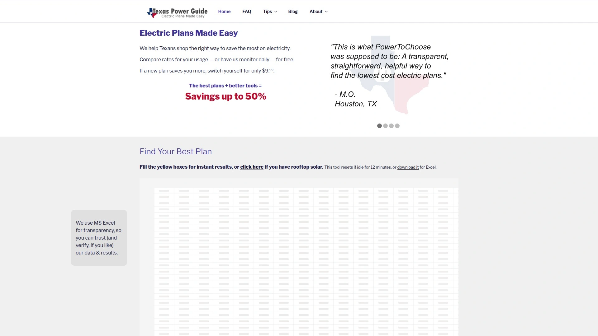

Texas Power Guide takes an unusual approach: they provide free access to a detailed Excel-based rate calculator that shows exactly how they analyze plans. You can see every formula, verify every calculation, and trust the results because nothing is hidden.

Their RateGrinder tool accounts for factors other sites ignore—billing cycle timing, non-cumulative rate structures, and the impact of having thirteen billing periods in a twelve-month contract. The calculator includes transmission and distribution charges from utilities like Oncor and CenterPoint.

The platform is run by engineers who got frustrated with misleading rate comparisons. Their documentation explains common pricing tricks and how to spot them. Everything is transparent and verifiable.

For customers who want ongoing monitoring, Texas Power Guide offers a paid service that tracks the market daily and alerts you when a better plan appears. The service costs ninety-nine dollars but saves the average customer hundreds annually by timing switches optimally.

## **[Energy Ogre](https://www.energyogre.com)**

Full-service electricity management for Texas customers who prefer complete automation.

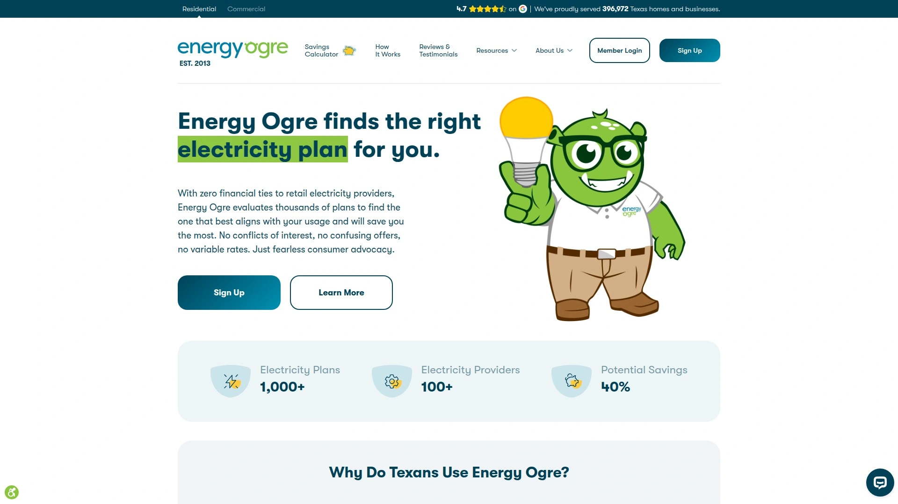

Energy Ogre operates as a concierge service rather than just a comparison tool. For ten dollars monthly, they handle everything related to your electricity account—shopping for plans, managing enrollments, monitoring contract expiration, and switching you to better deals when rates drop.

The service is independent with no financial ties to any retail electricity provider. Their algorithms evaluate thousands of plans against your actual usage data to find optimal matches. When your contract approaches expiration, Energy Ogre automatically shops the market and enrolls you in the best available plan.

This hands-off approach appeals to customers who don't want to think about electricity shopping. You authorize Energy Ogre to access your smart meter data and manage your accounts, then they handle renewals and switches without requiring your involvement.

Energy Ogre serves over three hundred ninety thousand Texas homes and businesses. Their system avoids variable rates and gimmicky bill credit plans, focusing on straightforward fixed-rate contracts that deliver predictable bills. Members save an average of up to forty percent on electricity costs.

## **[Power Wizard](https://www.powerwizard.com)**

Algorithm-driven plan recommendations with VIP membership for hands-off management.

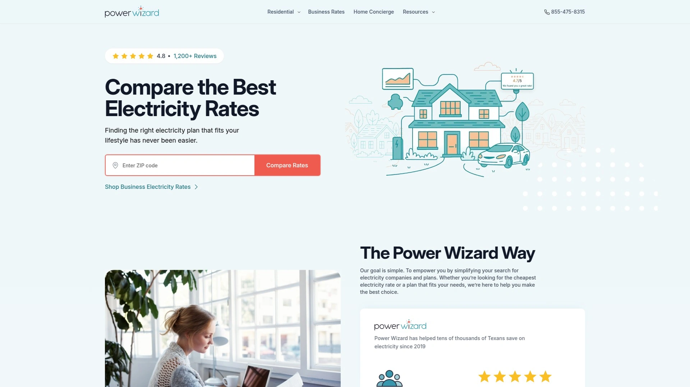

Power Wizard uses proprietary algorithms to analyze Texas electricity plans and recommend optimal matches based on your usage profile. The service offers two tiers: limited-time access to recommendations for fourteen ninety-five, or monthly VIP membership.

The VIP option provides ongoing market monitoring and automatic notifications when better plans become available. Power Wizard's system evaluates whether paying an early termination fee to switch mid-contract would save money overall.

The platform is owned by NextEra Energy but maintains that ownership doesn't influence plan rankings. Their algorithm evaluates hundreds of plans from competing providers based purely on projected costs for your specific usage pattern.

Results show total estimated costs rather than just per-kilowatt-hour rates. The system accounts for base charges, consumption tiers, and seasonal variations in your usage. Plans are ranked by which will deliver the lowest annual cost for your household.

## **[ElectricityRates.com](https://electricityrates.com)**

Licensed broker serving multiple states with over six thousand verified customer reviews.

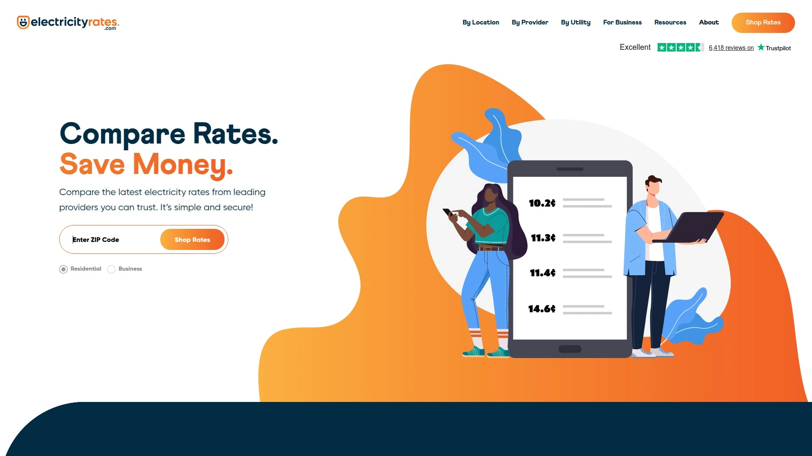

ElectricityRates.com operates as a licensed energy broker across multiple deregulated states including Texas, Pennsylvania, New Jersey, New York, Ohio, Illinois, and Maryland. The platform partners with over thirty-five providers to offer a wide selection of plans.

Their marketplace displays real-time rates with detailed plan information including contract terms, early termination fees, renewable energy percentages, and deposit requirements. The site maintains a "Price to Compare" benchmark for each utility territory so you can quickly see whether competitive offers beat your default rate.

Customer reviews on Trustpilot give the platform a four-point-seven star rating with over six thousand reviews. The site emphasizes transparency—clearly disclosing that they receive compensation from providers when customers enroll while maintaining editorial independence.

Business customers can request customized quotes through a dedicated commercial team that negotiates rates based on usage profiles and account size. The service includes energy bill optimization and ongoing rate monitoring.

## **[SaveOnEnergy](https://www.saveonenergy.com)**

One of the largest energy marketplaces with educational resources and solar guidance.

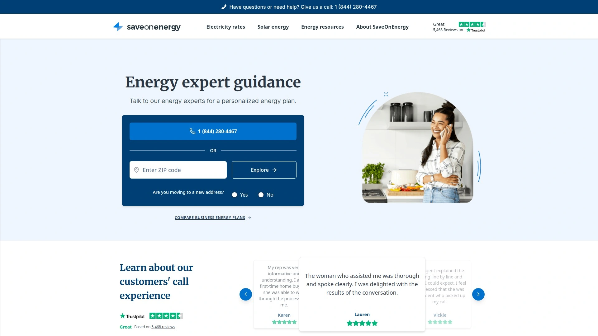

SaveOnEnergy has operated since two thousand three and claims to serve over one million Texas customers. The platform expanded to multiple deregulated states including New York, Pennsylvania, Ohio, Illinois, and Connecticut.

The site features extensive educational content covering energy-saving tips, market trends, and how deregulation works. Their comparison tools filter plans by price, contract length, plan type, and renewable energy content. Results include estimated monthly costs based on usage inputs.

SaveOnEnergy also provides solar panel guidance, connecting customers with installers and offering information about costs, financing, and expected savings. The platform serves as a one-stop resource for both electricity shopping and renewable energy exploration.

The company is owned by Red Ventures and maintains detailed city-specific guides for major markets. These guides highlight local trends, provider options, and average rates to help customers make informed decisions about when and how to shop.

## **[ElectricRate](https://www.electricrate.com)**

Multi-state platform with clean interface and side-by-side plan comparison tools.

ElectricRate serves deregulated markets across the United States with a streamlined comparison interface. The platform aggregates rates from conventional and renewable providers in one location, eliminating the need to visit multiple company websites.

Their comparison tool shows plans side-by-side with key details highlighted—rates per kilowatt-hour, contract length, early termination fees, and renewable energy percentages. You can filter results by these criteria to narrow options quickly.

The site includes contract expiration reminders via email, helping customers avoid automatic renewal into potentially expensive variable rates. This feature addresses a common problem where people forget to shop before their contract ends and get stuck paying higher default rates.

ElectricRate operates in states including Texas, Pennsylvania, New York, New Jersey, Ohio, Illinois, Maryland, Connecticut, Massachusetts, and New Hampshire. The platform is free for consumers, with providers paying to list their plans in the marketplace.

## **[Quick Electricity](https://quickelectricity.com)**

Texas-focused platform emphasizing fixed rates and green energy options with no-deposit plans.

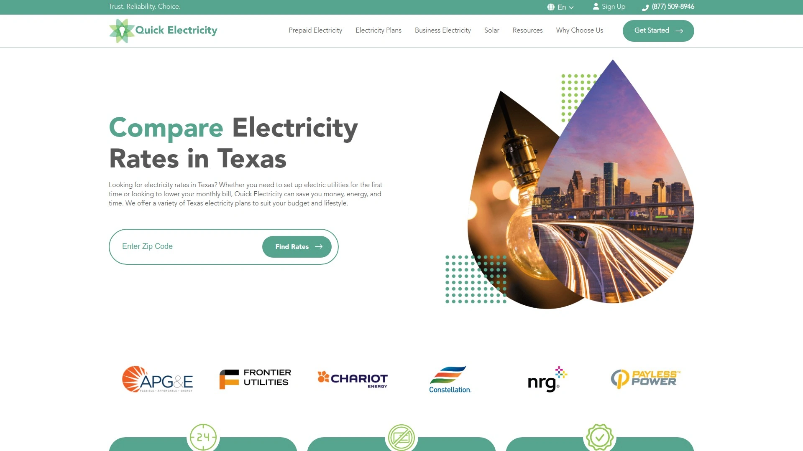

Quick Electricity specializes in the Texas market with particular attention to customers who need same-day service or have credit challenges. The platform offers numerous no-deposit and prepaid plans alongside traditional fixed-rate contracts.

Their comparison tools emphasize plan transparency, showing all-inclusive pricing that accounts for both supply and delivery charges. The site explains complex rate structures in plain language and flags plans with usage thresholds or bill credits that might not fit all customers.

Quick Electricity promotes green energy plans backed by renewable sources including wind and solar. These options appeal to environmentally conscious customers who want to reduce their carbon footprint without sacrificing price competitiveness.

The platform provides detailed guides explaining Texas electricity markets, how transmission charges work, and strategies for timing your switch to capture seasonal rate drops. Business customers can access commercial rate comparisons and request customized quotes for larger accounts.

## Are these comparison platforms really free to use?

Yes, the platforms themselves don't charge consumers for access or comparison tools. They receive compensation from electricity providers when customers enroll through their sites. This business model keeps the services free while allowing the platforms to operate sustainably. A few exceptions exist—Energy Ogre and Power Wizard's VIP tier charge monthly fees because they provide ongoing management services beyond simple comparison.

## How do I know which plan will actually save me money?

Enter your actual monthly usage in kilowatt-hours rather than guessing. Most comparison platforms can pull this data directly from your utility account or you can find it on recent bills. The key is comparing total estimated costs rather than just the per-kilowatt-hour rate. Many plans with low advertised rates include fees or tiered pricing that make them expensive for real-world usage patterns.

## Should I pick the cheapest rate or the shortest contract?

It depends on market conditions and your situation. When wholesale energy costs are low, locking in a longer fixed-rate contract protects you from future price increases. When rates are high or uncertain, shorter contracts give you flexibility to switch when better deals appear. Compare the total cost difference between contract lengths—sometimes a slightly higher rate for twelve months beats a rock-bottom six-month rate if you'll face higher renewal prices.

## Conclusion

Finding the right electricity plan doesn't require surrendering control to expensive subscription services or spending hours decoding confusing rate structures. These comparison platforms give you the tools to make informed decisions based on your actual usage and priorities.

[ComparePower](https://comparepower.com) stands out for Texas customers who want complete transparency without monthly fees—you get all-inclusive pricing, accurate bill projections, and straightforward comparisons that eliminate predatory plans. Whether you're switching for the first time or shopping at contract renewal, investing ten minutes to compare rates based on real usage data consistently delivers better results than accepting default utility rates or trusting providers' advertised numbers.
